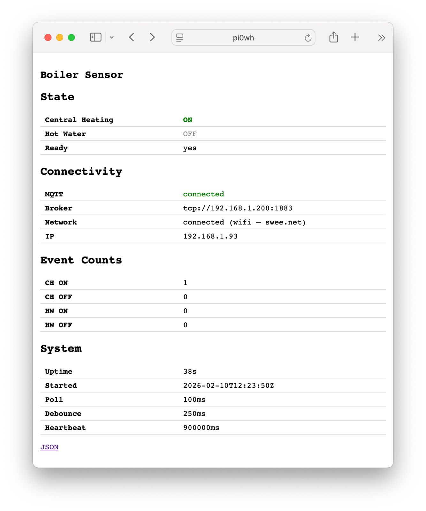

# boiler-sensor

A Go daemon for Raspberry Pi that monitors GPIO inputs for a heating system and publishes state changes to MQTT.

## What It Does

- Monitors two GPIO inputs: Central Heating (default BCM 26) and Hot Water (default BCM 16)
- Debounces input signals to filter noise
- Publishes JSON events to MQTT only when states change
- Runs as a systemd service on Raspberry Pi

## GPIO Pin Mapping

| Signal          | Default BCM Pin | Logic                        |
|-----------------|-----------------|------------------------------|
| Central Heating | 26              | Raw HIGH = OFF, raw LOW = ON |
| Hot Water       | 16              | Raw HIGH = OFF, raw LOW = ON |

Pin numbers are configurable via `--pin-ch` and `--pin-hw` flags.

### Why the Inverted Logic?

The optocoupler modules used in this project have inverted output behavior:

- **Heating ON**: Current flows through the optocoupler LED, the phototransistor conducts, pulling the output LOW (0)
- **Heating OFF**: No current through LED, phototransistor is off, pull-up resistor holds output HIGH (1)

This is the opposite of "conventional" logic where HIGH = ON.

### How It's Handled

The inversion is isolated to a single location in the codebase: `internal/gpio/real.go` lines 60-62:

```go
// Invert: raw active (1) = OFF, raw inactive (0) = ON
chOn := chRaw == 0
hwOn := hwRaw == 0
```

The rest of the codebase (business logic, MQTT publishing, tests) works with logical states where `true` = heating is ON. This keeps the complexity contained and makes the logic layer hardware-agnostic.

### Switching to Conventional Modules (HIGH = ON)

If you replace the optocouplers with modules that use conventional logic (HIGH when active), change lines 61-62 in `internal/gpio/real.go` from:

```go
chOn := chRaw == 0
hwOn := hwRaw == 0
```

to:

```go
chOn := chRaw == 1
hwOn := hwRaw == 1
```

No other code changes required - the GPIO layer handles all hardware abstraction.

## MQTT

**Topic:** `energy/BOILER_SENSOR/SENSOR/heating`

**Payload Example:**
```json
{
  "heating": {
    "timestamp": "2026-02-02T22:18:12Z",
    "event": "CH_ON",
    "ch": { "state": "ON" },
    "hw": { "state": "OFF" }
  }
}
```

Events: `CH_ON`, `CH_OFF`, `HW_ON`, `HW_OFF`

## Configuration Flags

| Flag        | Default                     | Description           |
|-------------|-----------------------------|-----------------------|
| `--poll`    | 100ms                       | GPIO polling interval |
| `--debounce`| 250ms                       | Debounce duration     |
| `--broker`  | tcp://192.168.1.200:1883    | MQTT broker address   |
| `--pin-ch`  | 26                          | BCM pin for Central Heating |
| `--pin-hw`  | 16                          | BCM pin for Hot Water |
| `--print-state` | false                   | Print state and exit  |
| `--heartbeat` | 15 minutes                | Heartbeat interval (0 to disable) |
| `--http`      | :80                       | HTTP status address (empty to disable) |

## Web Status



The daemon serves a lightweight status page over HTTP (default port 80):

- `GET /` or `GET /index.html` — HTML status page showing channel states, MQTT connectivity, event counts, uptime, and config
- `GET /index.json` — JSON status response for programmatic access

```bash
curl http://pi0wh/              # HTML page
curl http://pi0wh/index.json    # JSON response
```

Disable with `--http ""`.

## Development

### Run Tests

```bash
go test ./...
```

Tests run without GPIO or MQTT hardware using fake implementations.

### Run Tests with Coverage

```bash
go test -cover ./...
go test -coverprofile=cover.out ./internal/logic/ && go tool cover -html=cover.out
```

### Build

```bash
# Local
go build ./cmd/boiler-sensor

# For Raspberry Pi Zero (32-bit ARM)
GOOS=linux GOARCH=arm GOARM=6 go build -o boiler-sensor ./cmd/boiler-sensor
```

## CI

GitHub Actions runs tests on Linux amd64. No hardware or MQTT broker required. The `internal/logic` package requires 100% test coverage.

## Raspberry Pi Setup (From Scratch)

Complete instructions for setting up a fresh Pi.

### Prerequisites

**On your dev machine:**
- Go 1.21+ installed
- SSH access to the Pi

**On the Pi:**
- Raspberry Pi OS Lite (32-bit) - use [Raspberry Pi Imager](https://www.raspberrypi.com/software/)
- During imaging: set hostname, enable SSH, configure WiFi
- Note the Pi's IP address after boot

### Step 1: Prepare the Pi

SSH into the Pi and create the directory:

```bash
ssh pi@<PI_IP>
mkdir -p ~/boiler-sensor
```

### Step 2: Build the Binary (on dev machine)

From this repo on your dev machine:

```bash
GOOS=linux GOARCH=arm GOARM=6 go build -o boiler-sensor-arm ./cmd/boiler-sensor
```

### Step 3: Deploy Files to Pi

Copy the binary, service file, and setup script:

```bash
scp boiler-sensor-arm boiler-sensor.service setup.sh pi@<PI_IP>:~/boiler-sensor/
```

### Step 4: Run Setup Script

SSH into the Pi and run the setup script:

```bash
cd ~/boiler-sensor
sudo ./setup.sh
```

The script will:
- Make the binary executable
- Create symlinks to `/usr/local/bin/` and `/etc/systemd/system/`
- Add your user to the `gpio` group if needed
- Enable and start the service

### Step 5: Verify It's Working

```bash
sudo systemctl status boiler-sensor
sudo journalctl -u boiler-sensor -f
```

You should see "Connected to MQTT broker" and then silence until heating state changes.

### Updating the Binary

When you make changes, rebuild and copy:

```bash
# On dev machine
GOOS=linux GOARCH=arm GOARM=6 go build -o boiler-sensor-arm ./cmd/boiler-sensor
scp boiler-sensor-arm pi@<PI_IP>:~/boiler-sensor/

# On Pi
sudo systemctl restart boiler-sensor
```

### File Locations

| What | Location | Notes |
|------|----------|-------|
| Binary | `~/boiler-sensor/boiler-sensor-arm` | The actual file |
| Binary symlink | `/usr/local/bin/boiler-sensor` | Points to above |
| Service file | `~/boiler-sensor/boiler-sensor.service` | The actual file |
| Service symlink | `/etc/systemd/system/boiler-sensor.service` | Points to above |
| Logs | `journalctl -u boiler-sensor` | Managed by systemd |

### Troubleshooting

**Service won't start:**
```bash
sudo journalctl -u boiler-sensor -n 50 --no-pager
```

**GPIO permission denied:**
```bash
# Check user is in gpio group (reboot after setup.sh if just added)
groups
```

**MQTT connection failed:**
- Check broker is reachable: `nc -zv 192.168.1.200 1883`
- Override broker address: edit service or run manually with `--broker`

**Read current GPIO state without daemon:**
```bash
/usr/local/bin/boiler-sensor --print-state
```

## Debugging

Read current state without starting the daemon:
```bash
./boiler-sensor --print-state
```

## Implementation Notes

This project was built entirely using [Claude Code](https://claude.ai/code) (Claude Opus 4.5) in a single pairing session.

| Metric | Value |
|--------|-------|
| Total Go code | 2,750 lines |
| Production code | 833 lines |
| Test code | 1,917 lines |
| Test:Production ratio | 2.3:1 |
| Context used | ~134k tokens |
| Estimated cost | ~$5-10 USD |

The high test-to-production ratio reflects the strict requirement for 100% coverage on business logic and comprehensive integration tests that run without hardware.

## License

MIT
