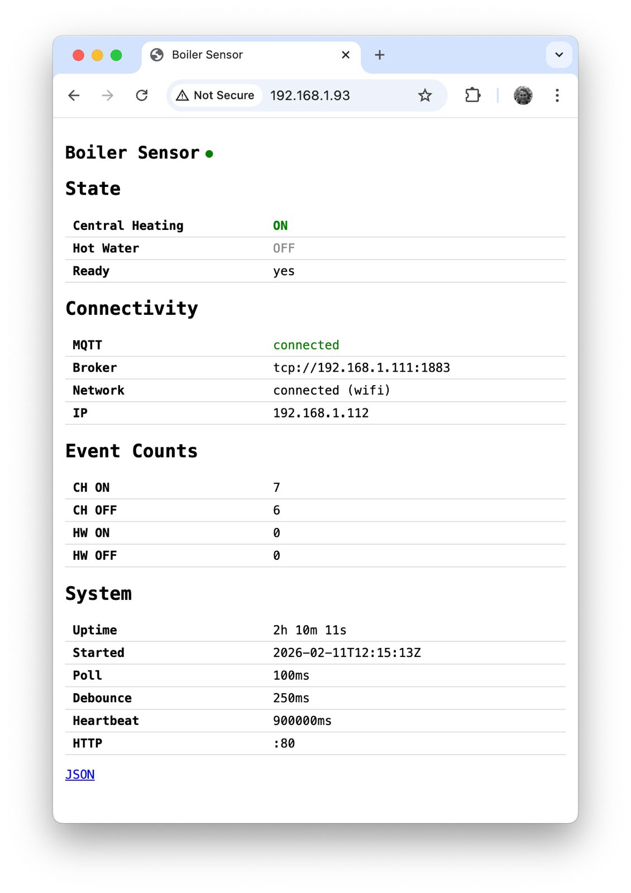

# boiler-sensor

A Go daemon for Raspberry Pi that monitors heating system GPIO inputs and publishes state transitions to MQTT. Designed for a Pi Zero running 32-bit Raspberry Pi OS Lite, but fully testable on any platform without hardware.

## What It Does

- Monitors two GPIO inputs: Central Heating (BCM 26) and Hot Water (BCM 16)
- Debounces signals to reject electrical noise
- Publishes JSON events to MQTT only on state transitions
- Sends system lifecycle events (startup, shutdown, heartbeat, reconnect)
- Serves a web status page over HTTP
- Runs as a systemd service with graceful shutdown

## Architecture

```
cmd/boiler-sensor/    # Entry point, flags, wiring — no business logic
internal/logic/       # Pure business logic — no external dependencies
internal/gpio/        # GPIO abstraction (real + fake implementations)
internal/mqtt/        # MQTT abstraction (real + fake implementations)
internal/status/      # Thread-safe status tracker (shared by web + MQTT)
internal/web/         # HTTP status server (JSON + HTML endpoints)
```

The strict separation between pure logic and I/O is the foundation of the project's testability. The logic package has zero imports from GPIO, MQTT, OS, or `time.Sleep` — all time is injected via parameters.

## GPIO

| Signal          | Default BCM Pin | Logic                        |
|-----------------|-----------------|------------------------------|
| Central Heating | 26              | Raw HIGH = OFF, raw LOW = ON |
| Hot Water       | 16              | Raw HIGH = OFF, raw LOW = ON |

Pin numbers are configurable via `--pin-ch` and `--pin-hw` flags.

### Why the Inverted Logic?

The optocoupler modules have inverted output: when heating is ON, current flows through the LED, the phototransistor conducts, pulling the output LOW. When heating is OFF, no current flows and the pull-up resistor holds the output HIGH.

This inversion is isolated to a single location (`internal/gpio/real.go`):

```go
// Invert: raw active (1) = OFF, raw inactive (0) = ON
chOn := chRaw == 0
hwOn := hwRaw == 0
```

The rest of the codebase works with logical states where `true` = ON. To switch to conventional modules (HIGH = ON), change these two comparisons to `== 1`.

## MQTT

### Event Topic: `energy/boiler/sensor/events`

Published on each state transition (QoS 0, not retained):

```json
{
  "boiler": {
    "timestamp": "2026-02-10T12:59:22Z",
    "event": "CH_ON",
    "ch": { "state": "ON" },
    "hw": { "state": "OFF" }
  }
}
```

Events: `CH_ON`, `CH_OFF`, `HW_ON`, `HW_OFF`

### System Topic: `energy/boiler/sensor/system`

Published for lifecycle events (QoS 1). Startup, shutdown, and heartbeat events include a full status snapshot:

```json
{
  "status": {
    "event": "STARTUP",
    "ch": "OFF",
    "hw": "OFF",
    "ready": false,
    "uptime_seconds": 0,
    "start_time": "2026-02-10T14:37:58Z",
    "timestamp": "2026-02-10T14:37:58Z",
    "mqtt": { "connected": false, "broker": "tcp://192.168.1.200:1883" },
    "event_counts": { "ch_on": 0, "ch_off": 0, "hw_on": 0, "hw_off": 0 },
    "config": { "poll_ms": 100, "debounce_ms": 250, "heartbeat_ms": 900000 }
  }
}
```

Simple events (LWT disconnect, reconnect) use a compact format:

```json
{ "system": { "timestamp": "2026-02-10T14:30:00Z", "event": "RECONNECTED" } }
```

The MQTT Last Will and Testament (LWT) is set to publish a `SHUTDOWN` event with reason `MQTT_DISCONNECT` if the connection drops unexpectedly.

## Web Status



The daemon serves a lightweight status page over HTTP (default port 80):

- `GET /` or `GET /index.html` — HTML status page with channel states, MQTT connectivity, event counts, uptime, and config
- `GET /index.json` — JSON status response for programmatic access

```bash
curl http://pi0wh/              # HTML page
curl http://pi0wh/index.json    # JSON response
```

Disable with `--http ""`.

## Configuration

| Flag            | Default                  | Description                          |
|-----------------|--------------------------|--------------------------------------|
| `--poll`        | 100ms                    | GPIO polling interval                |
| `--debounce`    | 250ms                    | Debounce duration                    |
| `--broker`      | tcp://192.168.1.200:1883 | MQTT broker address                  |
| `--pin-ch`      | 26                       | BCM pin for Central Heating          |
| `--pin-hw`      | 16                       | BCM pin for Hot Water                |
| `--heartbeat`   | 15m                      | Heartbeat interval (0 to disable)    |
| `--http`        | :80                      | HTTP status address (empty disables) |
| `--print-state` | false                    | Print current GPIO state and exit    |

## Testing

### Philosophy

The project is designed so that **all tests run without hardware** — no GPIO pins, no MQTT broker, no network. This is achieved through strict dependency injection: every external dependency (GPIO reads, MQTT publishing, time) is abstracted behind an interface with both a real and a fake implementation.

The architecture enforces a hard rule: `internal/logic` must have **zero imports** from I/O packages. It receives logical states and timestamps as plain values and returns domain events. This makes the core business logic trivially testable and means the debounce state machine can be exercised with thousands of synthetic inputs without touching hardware.

### Test Layers

**Unit tests (`internal/logic`)** — 100% coverage enforced by CI. These test the debounce state machine in isolation:
- Baseline establishment timing
- Single and simultaneous transitions
- Bounce/noise rejection (signals shorter than debounce duration)
- Back-to-back transitions
- Heartbeat generation and event counting
- Edge cases at exact debounce boundaries

**Fuzz test (`internal/logic`)** — feeds random sequences of GPIO samples into the detector and asserts invariants: no panics, valid event types, monotonic timestamps, no events before baseline, consistent event counts.

**Package-level unit tests** — each package tests its own concerns:
- `internal/gpio`: fake reader behaviour (sequential reads, error injection, reset)
- `internal/mqtt`: payload formatting and JSON round-trips, fake publisher recording, ring buffer for offline buffering
- `internal/status`: thread-safe tracker updates, snapshot immutability, JSON serialization
- `internal/web`: HTTP endpoint responses, content types, state reflection

**Integration tests (`internal/`)** — wire together fake GPIO + logic detector + fake MQTT publisher to verify the full pipeline:
- Exact event ordering from GPIO samples through to published JSON
- Payload format validation against expected JSON strings
- System event lifecycle (startup, transitions, heartbeat, shutdown)
- Graceful handling of publish failures
- Retained message flags for LWT and lifecycle events

**Main loop tests (`cmd/boiler-sensor`)** — test the `runLoop` function with injected dependencies:
- Signal handling (SIGINT, SIGTERM)
- GPIO error recovery
- Heartbeat scheduling
- Network info propagation

### Running Tests

```bash
go test ./...                    # Run all tests
go test -race ./...              # With race detector
go test -cover ./...             # With coverage summary
go test -coverprofile=c.out ./internal/logic/ && go tool cover -html=c.out  # HTML coverage report
```

### CI

GitHub Actions runs on every push to `main` and on pull requests:

1. **Test job** — `go vet`, tests with race detection, mandatory 100% coverage gate on `internal/logic`, per-package coverage reporting
2. **Build job** — cross-compiles for linux/amd64, linux/arm (Pi Zero), and linux/arm64

## Deployment

Use `deploy.sh` to build, upload, and restart the service in one command:

```bash
./deploy.sh              # default: sweeney@pi0wh
./deploy.sh user@host    # different target
```

The script:
1. Cross-compiles for ARM v6
2. Uploads a timestamped binary
3. Swaps the symlink (`boiler-sensor-arm` -> `boiler-sensor-<timestamp>`)
4. Runs first-time setup if the system symlinks don't exist yet
5. Restarts the systemd service
6. Cleans old versions (keeps 3)
7. Shows recent journal output

### First-Time Pi Setup

The first run of `deploy.sh` on a fresh Pi handles everything: creating system symlinks, adding the user to the `gpio` group, enabling the systemd service.

**Prerequisites:**
- Go 1.21+ on the dev machine
- SSH access to the Pi
- Raspberry Pi OS Lite (32-bit), hostname and WiFi configured via Raspberry Pi Imager

### File Locations on the Pi

| What            | Location                                   |
|-----------------|--------------------------------------------|
| Binary          | `~/boiler-sensor/boiler-sensor-<timestamp>`|
| Active symlink  | `~/boiler-sensor/boiler-sensor-arm`        |
| System symlink  | `/usr/local/bin/boiler-sensor`             |
| Service file    | `~/boiler-sensor/boiler-sensor.service`    |
| Service symlink | `/etc/systemd/system/boiler-sensor.service`|
| Logs            | `journalctl -u boiler-sensor`              |

### Troubleshooting

**Service won't start:**
```bash
sudo journalctl -u boiler-sensor -n 50 --no-pager
```

**GPIO permission denied:**
```bash
groups  # check gpio group membership — reboot after first deploy if just added
```

**MQTT connection failed:**
```bash
nc -zv 192.168.1.200 1883   # check broker reachability
```

**Read current GPIO state without the daemon:**
```bash
boiler-sensor --print-state
```

## Implementation Notes

This project was built using [Claude Code](https://claude.ai/code) (Anthropic Claude).

| Metric               | Value  |
|----------------------|--------|
| Production code      | ~1,575 lines |
| Test code            | ~3,880 lines |
| Test:Production ratio| 2.5:1  |

## License

MIT
